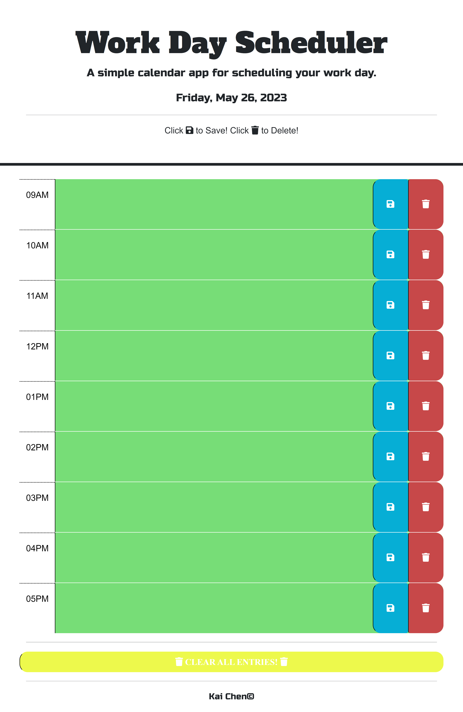

# Work-Day-Scheduler
This site is created for the 3rd-party APIs challenge.

## Description
<li>This WEB API uses HTML, CSS, and Java Script all together to contruct an interactive web application plan a work day schedule.</li>
<li>This work day planner start at 9AM and ends at 5PM.</li>
<li>As soon as the user opens the site, a current date is displayed at the top of the planner.</li>
<li>User can input any texts in the time block, once the save button is clicked, the inputs are stored in the localStorage and then printed in the same time block box. </li>
<li>Once the page is refreshed, the site will pull items from localStorage saved from previous entries and print in the related time block box. </li>

## Screenshot 

## Deployed Link and Repo Link
Deployed Weblink: https://ronin1702.github.io/Work-Day-Scheduler/ 
Repo Link: https://github.com/Ronin1702/Work-Day-Scheduler/  